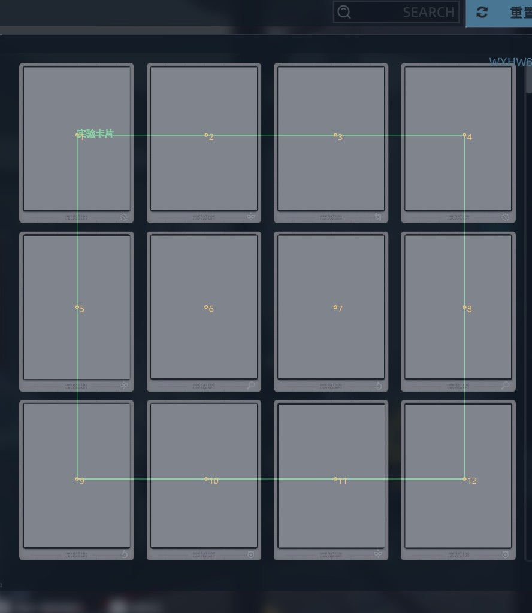
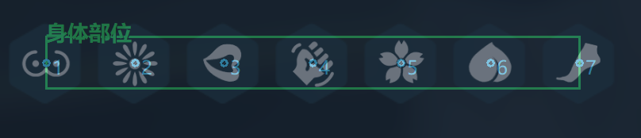
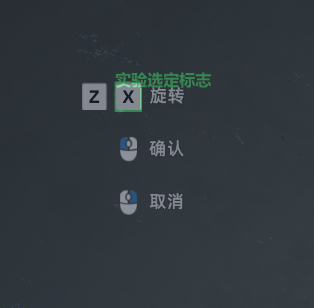
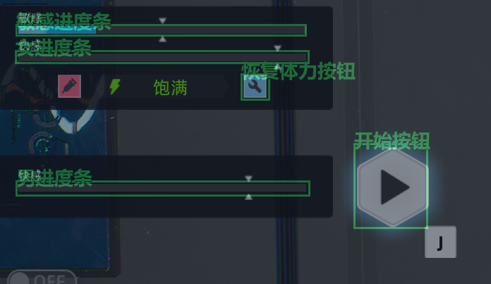
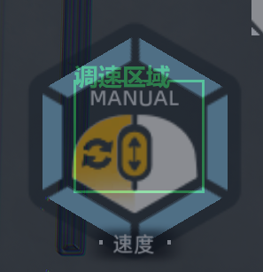
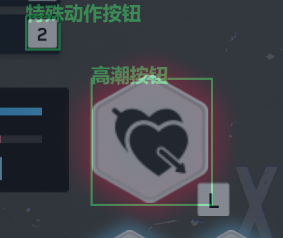
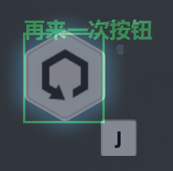
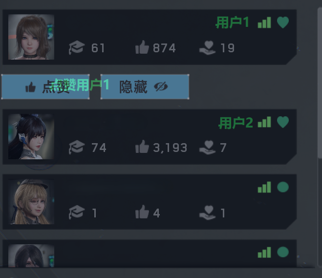
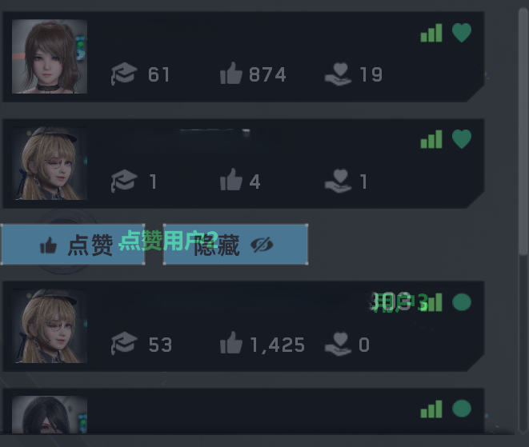
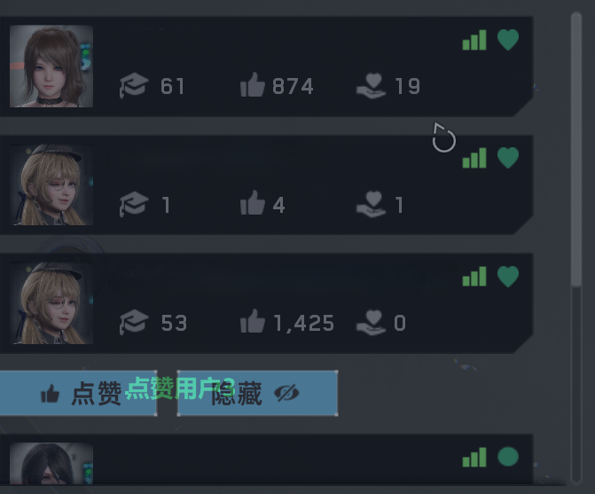

# 标定示例

> 本文用**操作顺序 + 注意点**说明如何标定，与 [使用说明.md](使用说明.md) 中的使用建议、热键等互补。下方 **§2、§3** 为**推荐标定顺序**；控制台内**自上而下**的条目顺序见 [附录](#appendix-calibration-items-order)（与 `autofdx/config.py` 中 `CALIBRATION_ITEMS` 一致，可与推荐顺序不同）。

示意图统一放在表格中，宽度已限制，避免占满整屏。

---

## 1. 通用操作

- **进入标定**：控制台点 `自定义标定` → 点对应条目 → 出现全屏半透明层与可调框（或圆点）。
- **保存 / 取消**：`Enter` 保存当前项，`Esc` 取消（不写入）。
- **核对位置**：保存后可用 `F12` 打开/关闭**全部标定区域叠加层**，检查框是否盖住目标、是否过大。
- **原则**：框尽量**紧贴**按钮文字或进度条彩条，少带背景；识别不稳时**缩小框**比放大更有效。

---

## 2. 推荐标定顺序

按下列**阶段编号**（自 **1** 起）依次完成；同一阶段内各项可按表中顺序标定。若**不启用**实验切换模式，可从**阶段 3** 起只标主流程所需项（阶段 1、2 为实验切换相关，可日后补标）。

### 阶段 1：实验卡片、身体部位、拉出新实验滚动

| 标定项 | 操作建议 | 示意图 |
|--------|----------|--------|
| `实验卡片` | 打开实验面板，一次性标定 **3×4 共 12 点**，覆盖每张实验卡片的可点中心（编号 1～12 为从左到右、从上到下）。 |  |
| `身体部位` | 标定 **7 个点**，对应身体部位条上各部位中心（与流程里 2 号/5 号切换一致）。 |  |
| `拉出新实验滚动` | 标定滚轮执行时鼠标停留点；保存时填写**向下滚动档位**。标定后可按 `F11` 重播，确认能滚出**下一行**（**下四个实验**，3×4 网格中的一整行）。 | *（无单独示意图，将定位点放在滚动条或非实验卡片可能涉及的区域后，调整滚动数值测试，直到能恰好滚动出新一行实验为止）* |

### 阶段 2：实验选定标志

| 标定项 | 操作建议 | 示意图 |
|--------|----------|--------|
| `实验选定标志` | 框住部署实验时显示的 **X 键（旋转实验）** 等「已选定」提示区域；示例为 **Z / X** 与「旋转」提示旁的 **X** 图标一带。 |  |

### 阶段 3：开始按钮、敏感进度条、女进度条、男进度条、恢复体力按钮、调速区域

> 界面名称为 **「敏感进度条」**；亦常称「敏感度进度条」，为同一项。

| 标定项 | 操作建议 |
|--------|----------|
| `开始按钮` | 框住「开始」按钮完整可点区域；请在游戏内能稳定看到该按钮时再标定。 |
| `敏感进度条` | 框住敏感度进度条的可视槽区域，便于颜色占比判断。 |
| `女进度条` | 框整条进度条槽（含左右端点），高度略大于彩条即可。 |
| `男进度条` | 同上，对应下方条；女/男勿对调。 |
| `恢复体力按钮` | 框住**恢复体力**按钮。 |
| `调速区域` | 框住调速器区域（示例为 **MANUAL** 与速度调节图标所在六边形区域）。 |

**示意图（分两张：同屏条带与开始；调速为独立一块 UI）**

| 说明 | 示意图 |
|------|--------|
| 同屏参考：**敏感进度条**、**女/男快感条**、**恢复体力**、**开始** 等，请按上表逐项框选（布局以你本机为准）。 |  |
| **调速区域**单独标定（常为 MANUAL 六边形）。 |  |

### 阶段 4：特殊动作按钮

| 标定项 | 操作建议 | 示意图 |
|--------|----------|--------|
| `特殊动作按钮` | 框住实验进行时进度条区域上方的 **特殊动作按钮**（示例图为上方 **「2」** 小方钮）。**同一张图下方为高潮按钮**，阶段 5 亦用此图。 |  |

### 阶段 5：高潮按钮

| 标定项 | 操作建议 | 示意图 |
|--------|----------|--------|
| `高潮按钮` | 框住同步高潮按钮区域（**大六边形心形按钮**）。 |  |

### 阶段 6：再来一次按钮

| 标定项 | 操作建议 | 示意图 |
|--------|----------|--------|
| `再来一次按钮` | 框住**再来一发**按钮区域（示例为带循环箭头的六边形按钮）。 |  |

**实验切换相关提示**：阶段 **1、2** 与阶段 **3** 中的 `恢复体力按钮` 在开启「实验切换模式」时均为必需；标定前请按 [使用说明.md](使用说明.md) 保证分辨率、UI 比例与正式运行一致。

### 阶段 2.5（可选）：自动补充体力

在控制台勾选 **「自动补充体力」** 时，除主流程的 **`恢复体力按钮`** 外，还须完成下列项（名称与控制台一致，勿与「体力补充按钮（独立）」混淆）：

| 标定项 | 操作建议 |
|--------|----------|
| `体力不足图标` | 框住**体力不足**时才会出现的图标区域（模板匹配）。 |
| `体力补充按钮（独立）` | 框住用于**打开补充流程**的独立按钮（与部署阶段判定的 `恢复体力按钮` 不是同一模板）。 |
| `使用凝胶确认` | 标定使用凝胶等**确认**操作的点击点。 |

流程时机：在「开始」按钮已出现、脚本即将点击开始前，若匹配到体力不足则自动点独立补充按钮 → 延时后再点凝胶确认。详见 `详细流程逻辑.md` / `README.md` 功能说明。

---

## 3. 点赞标定顺序（可选）

在启用 `启用点赞功能` 时，建议按下述**分步**操作，使对应点赞按钮在屏幕上可见后再标定圆点。

### 步骤 1

1. 在游戏内**点击一次第一个用户**，使 **用户 1 的点赞按钮**变为可见。
2. 依次标定：**`用户1`**、**`点赞用户1`**、**`用户2`**（圆点模式）。

| 说明 | 示意图 |
|------|--------|
| 展开后可见 **点赞 / 隐藏**，请标定 **用户1**、**点赞用户1**、**用户2** 圆点位置。 |  |

### 步骤 2

1. **点击一次第二个用户**，使 **用户 2 的点赞按钮**可见。
2. 依次标定：**`点赞用户2`**、**`用户3`**。

| 说明 | 示意图 |
|------|--------|
| 点击第二行用户后，标定 **点赞用户2**、**用户3**。 |  |

### 步骤 3

1. **点击一次第三个用户**，使 **用户 3 的点赞按钮**可见。
2. 标定：**`点赞用户3`**。

| 说明 | 示意图 |
|------|--------|
| 点击第三行用户后，标定 **点赞用户3**。 |  |

标定完成后可用 `F12` 核对各圆点是否落在可点击处。

---

## 4. 常见问题（标定专项）

- **匹配总失败**：检查是否换过分辨率/缩放；缩小模板区域；确认模板截图未被标定层 UI 截进去（程序会在截图前隐藏标定层，一般无需担心）。
- **进度条乱跳**：女/男条区域勿重叠；框高度不宜过大，避免采到背景。
- **滚轮无效或滚过头**：调 `调速区域` 与 `拉出新实验滚动` 的**向下滚动档位**，用 `F11` 实测后再保存。

更通用的故障排查见 [使用说明.md](使用说明.md) 第 3 节「常见问题」。

---

## 附录：控制台标定项顺序（与程序一致）

悬浮窗 `自定义标定` 列表**自上而下**的显示顺序如下，与 `autofdx/config.py` 中 `CALIBRATION_ITEMS` 一致（与推荐标定阶段顺序可不同）。

| 顺序 | 名称 |
|------|------|
| 1 | 开始按钮 |
| 2 | 高潮按钮 |
| 3 | 单高潮按钮 |
| 4 | 再来一次按钮 |
| 5 | 实验选定标志 |
| 6 | 恢复体力按钮 |
| 7 | 体力不足图标 |
| 8 | 体力补充按钮（独立） |
| 9 | 使用凝胶确认 |
| 10 | 敏感进度条 |
| 11 | 特殊动作按钮 |
| 12 | 拉出新实验滚动 |
| 13 | 实验卡片 |
| 14 | 身体部位 |
| 15 | 女进度条 |
| 16 | 男进度条 |
| 17 | 调速区域 |
| 18～23 | 用户1、用户2、用户3、点赞用户1、点赞用户2、点赞用户3 |
| 24 | 赞池 |
