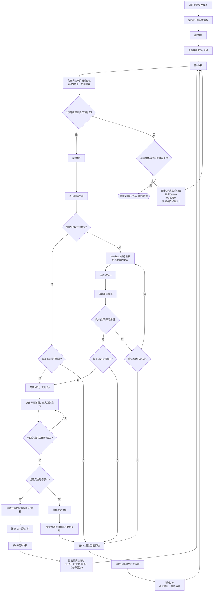
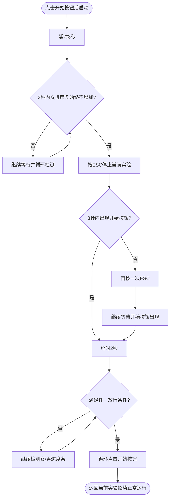
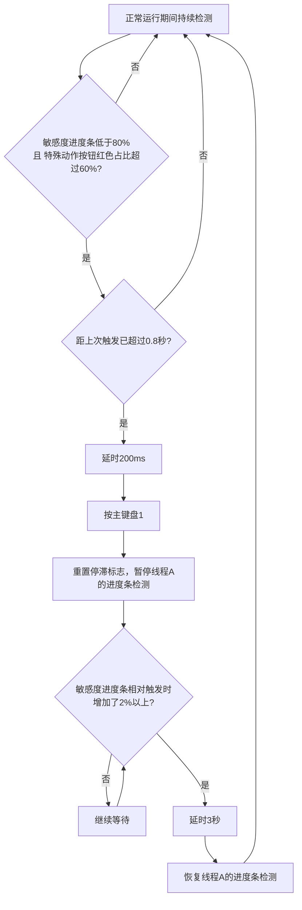

# 详细流程逻辑

> 本文合并了原 README 中的主流程、并发线程与实验切换说明，以及原项目根目录 `流程.md` 中的阶段详解与流程图。实验切换各阶段与「线程 A / B」行为均以本节为准。

**相关文档**：[使用说明.md](使用说明.md)（使用建议、热键、常见问题）、[标定示例.md](标定示例.md)（标定顺序、示意图与控制台标定项顺序表）。

---

## 1. 自动流程概览

### 1.1 基础模式（不开启实验切换）

1. 等待并点击 `开始`
2. 进入"开始后到高潮前"阶段
   - 主线程检测状态与按钮，副线程执行滚轮纠偏
   - 线程 A：监测女进度条是否停滞（详见第 2 节）
   - 线程 B：监测敏感度是否不足（详见第 3 节）
3. 识别到 `高潮` 后停止纠偏并快速点击
4. 等待并点击「再来一次/结束」
5. 按规则触发点赞（详见第 4 节）

### 1.2 实验切换模式

开启后程序自动完成：选定实验 → 部署实验 → 正常运行 → 满 5 回合后切换下一实验，循环执行直到所有实验完成。阶段与分支详见第 5 节及之后。

---

## 2. 女进度条停滞恢复（线程 A）

点击开始按钮后延时 **3 秒**开始监测。若 **3 秒内**女进度条始终不增加，执行以下恢复流程：

1. 按 `ESC` 停止当前实验
2. 等待开始按钮出现；若 3 秒内未出现，再补按一次 `ESC` 后继续等待
3. 开始按钮出现后等待 **2 秒**
4. 持续检测女/男进度条占比，满足以下任一条件即继续运行：
   - 两者相差不超过 **20%**
   - 两者占比都为 **0**（视为相等）
   - 女进度条占比**大于**男进度条，且女进度条占比**小于 60%**
5. 循环点击开始按钮，**返回当前实验继续正常运行**（不切换实验）

---

## 3. 敏感度不足自动补偿（线程 B）

与主流程并行运行，持续轮询，触发节流为 **0.8 秒**内不重复触发。

- 触发条件：敏感进度条 **< 80%** 且 特殊动作按钮红色占比 **> 60%**
  1. 延时 200ms 后按主键盘 `1`
  2. 重置停滞标志，**暂停**线程 A 的女进度条变化检测
  3. 等待敏感进度条**明显上升**（相对触发时基线增加 **2%** 以上）
  4. 上升达成后，再额外延时 **3 秒**
  5. **恢复**线程 A 的检测

---

## 4. 点赞触发规则

- 默认每 **5** 次主流程触发一次点赞；
- 若勾选 `结束后执行点赞`，则在下一次流程结束后立即点赞一次；
- 该次立即点赞执行后，点赞计数归零，后续继续按 5 回合周期触发。

---

## 5. 实验切换模式 — 速览表

### 5.1 阶段概览

| 阶段 | 说明 |
|------|------|
| 选定身体部位 | 首次启动按 `E` 打开面板，点击 2 号身体部位（备选 5 号） |
| 尝试选定实验 | 延时 1 秒后点击当前实验卡片，等待 2 秒内出现"实验选定标志" |
| 尝试部署实验 | 延时 1 秒后左键点击，等待 2 秒内同时出现"开始按钮"和"恢复体力按钮" |
| 移动视角部署 | 开始按钮未出现时，鼠标右移屏幕宽度的 1/10 后重试，最多 5 次 |
| 实验已用尽 | 12 张卡片均无法选中，切换到 5 号身体部位重试；5 号也用尽则程序暂停 |
| 切换下一实验 | 按 `ESC` → 延时 1 秒 → 按 `E` → 延时 1 秒 → 点位顺延，计数清零 |
| 当页实验全部完成 | 点位号 = 12 时，调起「拉出新实验滚动」（滚出**下一行**，即**下四个实验**）并将点位号重置为 9 |

### 5.2 5 回合结束后的分支

| 条件 | 操作 |
|------|------|
| 当前实验为本页最后一个（点位号 = 12） | 进入【当页实验全部完成】 |
| 当前实验不是本页最后一个（点位号 ≠ 12） | 调起点赞流程 → 点赞结束后 **不点击开始按钮** → 等待开始按钮出现后延时 2 秒 → 进入【切换下一实验】 |

---

## 6. 实验切换模式 — 启动入口与各阶段详解

实验切换模式开启后，程序按下 `E` 键打开实验面板，进入 **【选定身体部位】** 阶段。

### 【选定身体部位】

1. 延时 1 秒
2. 点击身体部位 **2号点**（备选 5号点，仅取 2、5 号点）
3. → 进入 **【尝试选定实验】**

### 【尝试选定实验】

1. 延时 1 秒
2. 点击实验卡片当前点位（首次为 1 号点，后续顺延）
3. 等待最多 2 秒，判断是否出现 **"实验选定标志"**
   - ✅ 出现 → 进入 **【尝试部署实验】**
   - ❌ 未出现 → 进入 **【实验已用尽】**

### 【尝试部署实验】

1. 延时 1 秒
2. 点击鼠标左键
3. 等待最多 2 秒，判断是否出现 **开始按钮**
   - ✅ 出现开始按钮 **且** "恢复体力按钮"存在 → 部署成功，延时 1 秒后进入 **正常运行**
   - ❌ 未出现开始按钮 → 进入 **【移动视角部署】**
   - ❌ 出现开始按钮 **但** 未出现“恢复体力按钮” →【切换下一实验】

### 【移动视角部署】

1. 使用 SendInput 底层输入将鼠标向右移动（当前屏幕横向分辨率的 1/10）
2. 延时 500ms
3. 点击鼠标左键
4. 等待最多 2 秒，判断结果（最多重试 5 次）：
   - ✅ 出现开始按钮 **且** "恢复体力按钮"存在 → 部署成功，延时 1 秒后进入 **正常运行**
   - ⚠️ 出现开始按钮 **但** "恢复体力按钮"不存在 → 直接进入 **【切换下一实验】**
   - ❌ 开始按钮和"恢复体力按钮"均不存在 → 重试（最多 5 次），超过后进入 **【切换下一实验】**

### 【实验已用尽】

> 触发条件：点击实验卡片后 2 秒内未出现"实验选定标志"，或实验卡片点位号超出 12

| 当前身体部位点位号 | 操作 |
|---|---|
| ≠ 5（当前为 2 号） | 点击身体部位 **2号点**取消勾选 → 延时 500ms → 点击身体部位 **5号点** → 将实验点位号置为 **1** → 进入 **【尝试选定实验】** |
| = 5 | 2号与5号实验均已用尽，**暂停程序** |

### 【切换下一实验】

1. 按 `ESC` 退出当前实验
2. 延时 1 秒后按 `E` 重新打开实验面板
3. 延时 1 秒，实验卡片点位 **顺延**，**重置实验计数为 0**
4. → 重新进入 **【尝试选定实验】**

### 【当页实验全部完成】

> 触发条件：正常运行 5 回合后，当前实验为本页最后一个（实验点位号 = 12）

1. 等待开始按钮出现后，延时 2 秒
2. 按 `ESC` 退出当前实验，延时 1 秒
3. 按 `E` 打开实验面板，延时 1 秒
4. 调起 **「拉出新实验滚动」**（滚出**下一行**，即**下四个实验**，与 3×4 网格中的一整行一致）
5. 将下次选定实验点位号置为 **9**
6. → 进入 **【尝试选定实验】**

---

## 7. 正常运行阶段与并发线程（与第 1～4 节对应）

以下在「实验已部署、点击开始后的正常运行」期间与主流程并行；**女进度条卡死检测**、**敏感度不足检测**的逐步说明已分列于本文第 2、3 节，此处仅作索引：

- **主流程**：点击开始按钮，进入第 1.1 节所述循环（含滚轮纠偏、高潮与「再来一次/结束」检测等）。
- **线程 A**：女进度条停滞恢复 → 见 **第 2 节**。
- **线程 B**：敏感度不足自动补偿 → 见 **第 3 节**。

---

## 8. 5 回合结束后的分支（与 5.2 节一致）

正常运行满 **5 回合**后：

| 条件 | 操作 |
|------|------|
| 当前实验为本页最后一个（点位号 = 12） | 进入 **【当页实验全部完成】**（见第 6 节末尾） |
| 当前实验不是本页最后一个（点位号 ≠ 12） | 调起点赞流程 → 点赞结束后 **不点击开始按钮** → 等待开始按钮出现后延时 2 秒 → 进入 **【切换下一实验】** |

---

## 9. 流程图

> 共三张图：主流程图 + 两个并发检测线程图（正常运行期间后台持续运行）

### 图1：主流程

### 图2：线程 A — 女进度条卡死检测

> 点击开始按钮后在后台启动，与主流程并行运行

### 图3：线程 B — 敏感度不足检测

> 与主流程并行运行，持续轮询

